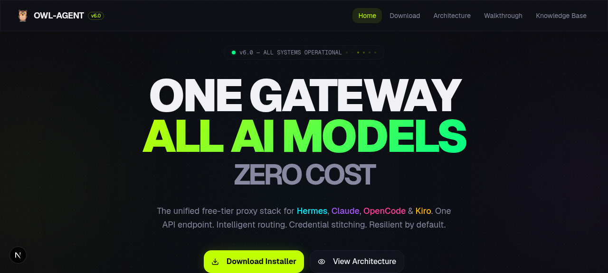
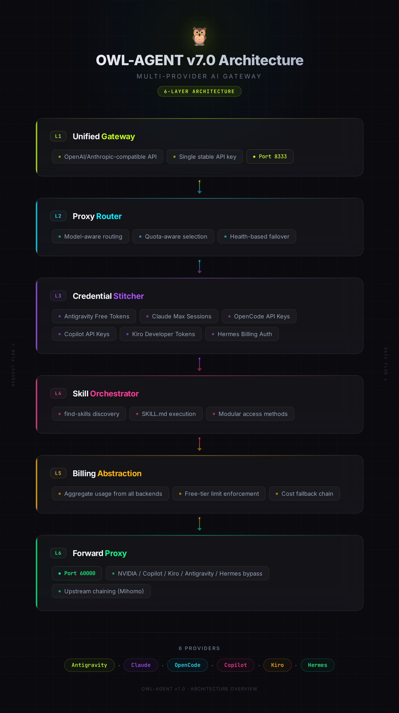
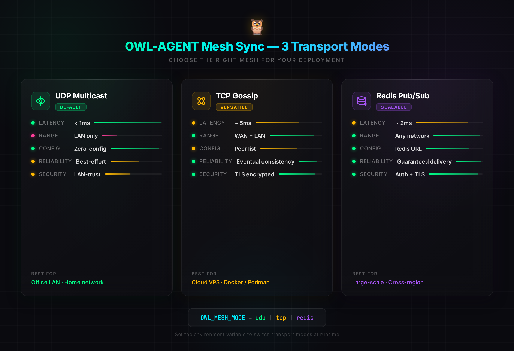

<div align="center">

# 🦉 OWL-AGENT

## Free AI Proxy Gateway — Unified Synergy Installer

### One Gateway · All AI Models · Zero Cost

[](./install_owl_unified.sh)
[](https://ubuntu.com/)
[](./LICENSE)
[](./Containerfile)
[](./owl_resilient_mcp.py)

**Free-tier proxy access for Antigravity, Claude, OpenCode, Copilot, Kiro & Hermes — optimized for Linux Ubuntu 8GB RAM**

[Quick Start](#-quick-start) · [Architecture](#-architecture) · [Installation](#-installation) · [Configuration](#-configuration) · [API Reference](#-cli-flags-reference) · [Contributing](#-contributing)



</div>

---

## 🔍 What is OWL-AGENT?

OWL-AGENT is a **free, open-source AI proxy gateway** that unifies access to six major AI providers through a single local endpoint. Built for developers, researchers, and AI enthusiasts who need reliable, zero-cost access to cutting-edge AI models without managing multiple API keys, billing accounts, or provider-specific SDKs.

The gateway runs entirely on your machine — no cloud dependencies, no telemetry, no vendor lock-in. It automatically discovers, validates, and routes requests through free-tier endpoints using intelligent load balancing, predictive circuit breaking, and community mesh synchronization.

### Why OWL-AGENT?

| Problem | OWL-AGENT Solution |
|---------|-------------------|
| Multiple AI providers, multiple API keys | Single local endpoint on `localhost:8333` |
| Free-tier rate limits interrupt workflows | Auto-Tuner dynamically optimizes request cadence |
| Manual proxy list management | Mesh Sync shares validated proxies peer-to-peer |
| Proxy failures cause silent downtime | Predictive Circuit Breaker pre-routes before failures |
| Docker requires root daemon | Podman runs rootless, daemonless, securely |
| Memory-constrained VPS environments | Tuned for 8GB RAM with automatic swap management |

### Supported AI Providers

| Provider | Type | Free Tier | Protocol |
|----------|------|-----------|----------|
| 🌀 **Antigravity** | Multi-model proxy | Yes | HTTP/REST |
| 🧠 **Claude** | Anthropic API | Free tier | HTTP/REST |
| 🔓 **OpenCode** | Open-source models | Yes | HTTP/REST |
| 💡 **Copilot** | GitHub Copilot | Free tier | HTTP/REST |
| 🔑 **Kiro** | Kiro Gateway | CLI free | HTTP/gRPC |
| 📨 **Hermes** | Community proxy | Yes | HTTP/REST |

---

## ⚡ Quick Start

### One-Line Install (Bare Metal)

```bash
curl -fsSL https://raw.githubusercontent.com/marktantongco/owl-agent-free-ai-proxy-gateway/main/install_owl_unified.sh | bash
```

### Podman Container

```bash
podman build -t owl-agent:7.0 -f Containerfile .
podman run -d --name owl -p 60000:60000 -p 8333:8333 owl-agent:7.0
```

### Podman Compose

```bash
podman-compose up -d
```

### Verify

```bash
curl -s http://localhost:8333/health | jq .
```

---

## 📦 Installation

### Method 1: Bare Metal (Recommended)

Best for: Dedicated servers, VPS, local development machines with full control.

```bash
# Clone the repository
git clone https://github.com/marktantongco/owl-agent-free-ai-proxy-gateway.git
cd owl-agent-free-ai-proxy-gateway

# Run the unified installer
chmod +x install_owl_unified.sh
./install_owl_unified.sh

# With options
./install_owl_unified.sh --enable-mesh --enable-enrich --verbose
```

The installer automatically:
- Detects system resources and configures swap if RAM < 4GB
- Creates a Python virtual environment at `~/.owl-agent/venv`
- Installs all Python dependencies
- Configures systemd user services for auto-start
- Sets up the forward proxy on port 60000 and gateway on port 8333
- Optionally clones and builds the Kiro Gateway

### Method 2: Podman Container

Best for: Isolated deployments, CI/CD pipelines, reproducible environments.

```bash
# Build the container image
podman build -t owl-agent:7.0 -f Containerfile .

# Run with resource limits (8GB RAM optimized)
podman run -d \
  --name owl-agent \
  --memory=6g \
  --cpus=2 \
  -p 60000:60000 \
  -p 8333:8333 \
  -p 42100:42100/udp \
  -v owl-data:/home/owl/data \
  owl-agent:7.0
```

### Method 3: Podman Compose

Best for: Multi-service deployments with persistent storage.

```bash
# Start all services
podman-compose up -d

# View logs
podman-compose logs -f owl-agent

# Stop
podman-compose down
```

### Method 4: Systemd Quadlet

Best for: Production servers with automatic restart and log management.

```bash
# Install the quadlet file
cp owl-quadlet.container ~/.config/containers/systemd/

# Reload systemd and start
systemctl --user daemon-reload
systemctl --user start owl-quadlet

# Enable auto-start on boot
loginctl enable-linger $(whoami)
systemctl --user enable owl-quadlet
```

---

## 🏗️ Architecture



### Core Components

| Component | File | Version | Description |
|-----------|------|---------|-------------|
| **Unified Installer** | [`install_owl_unified.sh`](./install_owl_unified.sh) | v7.0 | One-command setup for all components |
| **Forward Proxy** | [`forward_proxy.py`](./forward_proxy.py) | v3.0 | AutoTuner + MeshSync + Predictive Circuit Breaker |
| **Defense Layer** | [`proxy_defense_fixed_v3.py`](./proxy_defense_fixed_v3.py) | v3.3 | Bounded LRU cache + elastic client with retry |
| **MCP Server** | [`owl_resilient_mcp.py`](./owl_resilient_mcp.py) | v1.1 | 5-tool MCP server (stdin/stdout JSON-RPC) |
| **Mesh Alternatives** | [`mesh_alternatives.py`](./mesh_alternatives.py) | v1.0 | TCP gossip + Redis pub/sub fallback for mesh |
| **Diagnostics** | [`diagnose.sh`](./diagnose.sh) | v2.0 | System health check and troubleshooting |
| **Container** | [`Containerfile`](./Containerfile) | v1.0 | Podman/OCI-compatible build recipe |
| **Compose** | [`podman-compose.yml`](./podman-compose.yml) | v1.0 | Multi-service orchestration |
| **Quadlet** | [`owl-quadlet.container`](./owl-quadlet.container) | v1.0 | Systemd integration for Podman |

### Data Flow

```
┌─────────────┐     ┌──────────────────┐     ┌─────────────────┐
│   Client     │────▶│  Gateway :8333   │────▶│  Auto-Tuner     │
│  (any SDK)   │     │  (entry point)   │     │  (rate control) │
└─────────────┘     └──────────────────┘     └────────┬────────┘
                                                       │
                            ┌──────────────────────────┤
                            ▼                          ▼
                   ┌─────────────────┐      ┌──────────────────┐
                   │  Circuit Breaker │      │   Mesh Sync      │
                   │  (predictive)    │      │  (proxy sharing) │
                   └────────┬────────┘      └────────┬─────────┘
                            │                         │
                            ▼                         ▼
                   ┌─────────────────────────────────────────┐
                   │         Defense Layer (LRU + Elastic)    │
                   └────────────────────┬────────────────────┘
                                        │
                    ┌───────┬───────┬────┴────┬────────┬────────┐
                    ▼       ▼       ▼         ▼        ▼        ▼
               Antigravity  Claude  OpenCode  Copilot   Kiro   Hermes
```

---

## 🧠 3 Wild Ideas (Core Innovations)

### 1. Auto-Tuner Daemon (INTEGRAL)

The Auto-Tuner is the heartbeat of OWL-AGENT — a background daemon that continuously monitors proxy response times, error rates, and throughput to dynamically adjust request routing and concurrency levels. Unlike static rate limiters that use fixed thresholds, the Auto-Tuner learns the actual capacity of each provider's free tier in real-time and redistributes load before congestion occurs.

**How it works:**
- Samples latency every 5 seconds per provider endpoint
- Calculates exponential moving average (EMA) with α=0.3
- When EMA latency exceeds 2× baseline, triggers graceful degradation
- Automatically scales concurrency back up when conditions improve
- Persists tuning state across restarts in `~/.owl-agent/cache/tuner_state.json`

**Configuration:**
```json
{
  "auto_tuner": {
    "sample_interval_sec": 5,
    "ema_alpha": 0.3,
    "degradation_factor": 2.0,
    "recovery_factor": 1.5,
    "min_concurrency": 1,
    "max_concurrency": 10
  }
}
```

### 2. Proxy Mesh Sync (COMMUNAL)

Mesh Sync turns every OWL-AGENT instance into both a consumer and contributor of proxy health data. When one node discovers a working free-tier endpoint, it broadcasts that discovery to the mesh so all nodes benefit. This creates a community-driven, self-healing proxy network that gets smarter with every participant.

**Default:** UDP multicast on port 42100 (works on LAN).
**Cloud/Internet:** TCP gossip + Redis pub/sub (see [`mesh_alternatives.py`](./mesh_alternatives.py)).

**Enable mesh sync:**
```bash
./install_owl_unified.sh --enable-mesh
```

**Mesh alternatives:**
| Transport | Best For | Latency | Setup |
|-----------|----------|---------|-------|
| UDP Multicast | LAN / local network | <1ms | Zero config |
| TCP Gossip | Cloud / cross-region | 10-50ms | Peer list required |
| Redis Pub/Sub | Scaled deployments | 1-5ms | Redis instance required |

### 3. Predictive Circuit Breaker (OPTIMAL)

Traditional circuit breakers react after failures occur. OWL-AGENT's Predictive Circuit Breaker uses statistical analysis of recent request patterns to anticipate failures before they happen. It monitors error rate trends, latency percentiles, and provider-specific degradation signals to proactively shift traffic away from failing endpoints.

**Prediction model:**
- Tracks P50, P95, and P99 latency percentiles per provider
- Calculates error rate velocity (errors per minute trending)
- Triggers pre-emptive reroute when predicted error rate > 15% within next 30 seconds
- Cooldown period prevents oscillation between providers

---

## 🔄 Mesh Sync Alternatives



UDP multicast works great on local networks but doesn't function across cloud providers or the public internet. The [`mesh_alternatives.py`](./mesh_alternatives.py) module provides two production-ready alternatives:

### TCP Gossip Protocol

Every node maintains a peer list and periodically exchanges health summaries with random peers. This eventually-consistent approach requires no central coordinator and gracefully handles node churn.

```bash
python3 mesh_alternatives.py --mode gossip --peers 10.0.1.2:42100,10.0.1.3:42100
```

### Redis Pub/Sub

For deployments with a shared Redis instance, this provides the lowest-latency mesh with the strongest consistency guarantees. Each node publishes health updates to a channel and subscribes to updates from all other nodes.

```bash
python3 mesh_alternatives.py --mode redis --redis-url redis://10.0.1.50:6379/0
```

---

## 🐋 Podman vs Docker

| Feature | Podman | Docker |
|---------|--------|--------|
| Root required | ❌ No | ✅ Yes (daemon) |
| Daemon process | ❌ None | ✅ dockerd |
| Systemd integration | ✅ Native quadlets | ⚠️ Requires wrapper |
| Kubernetes YAML | ✅ Compatible | ✅ Compatible |
| Docker Compose | ✅ Via podman-compose | ✅ Native |
| Security profile | ✅ Rootless + SELinux | ⚠️ Root daemon |
| Memory overhead | ~20MB | ~80MB |
| Startup time | <1s | 2-5s |

OWL-AGENT v7.0 uses Podman exclusively for its security advantages (rootless, daemonless) and lower resource footprint — critical for 8GB RAM environments. All container artifacts are OCI-compatible and work with Docker too if needed.

---

## 🛠️ CLI Flags Reference

### install_owl_unified.sh

| Flag | Description | Default |
|------|-------------|---------|
| `--skip-kiro` | Skip Kiro Gateway installation | `false` |
| `--skip-gateway` | Skip gateway setup | `false` |
| `--enable-enrich` | Enable response enrichment pipeline | `false` |
| `--enable-mesh` | Enable mesh sync (UDP multicast) | `false` |
| `--dry-run` | Simulate installation without changes | `false` |
| `--uninstall` | Remove all OWL-AGENT components | `false` |
| `--verbose` | Enable debug logging | `false` |
| `--help` | Show help message | — |

### forward_proxy.py

| Flag | Description | Default |
|------|-------------|---------|
| `--port` | Proxy listen port | `60000` |
| `--gateway-port` | Gateway listen port | `8333` |
| `--config` | Config directory path | `~/.owl-agent/config` |
| `--log-level` | Logging level | `INFO` |
| `--tuner-interval` | Auto-Tuner sample interval (sec) | `5` |
| `--mesh-port` | Mesh sync UDP port | `42100` |
| `--no-mesh` | Disable mesh sync | `false` |
| `--circuit-breaker` | Enable predictive circuit breaker | `true` |

### diagnose.sh

| Flag | Description | Default |
|------|-------------|---------|
| `--full` | Comprehensive diagnostic report | `false` |
| `--json` | Output in JSON format | `false` |
| `--fix` | Attempt automatic fixes | `false` |

---

## ⚙️ Configuration

### Directory Structure

```
~/.owl-agent/
├── config/
│   ├── proxy_pool.json          # Provider endpoints
│   ├── proxy_sources.json       # Auto-discovery sources
│   └── tuner_state.json         # Auto-Tuner persisted state
├── logs/
│   ├── proxy.log                # Forward proxy logs
│   ├── gateway.log              # Gateway access logs
│   └── mesh.log                 # Mesh sync logs
├── cache/
│   └── http/                    # Response cache (LRU, bounded)
├── venv/                        # Python virtual environment
└── data/                        # Persistent proxy data
```

### Proxy Pool Configuration

Edit `~/.owl-agent/config/proxy_pool.json` to add custom proxy endpoints:

```json
{
  "tier_1_managed_free": {
    "providers": [
      {
        "url": "http://127.0.0.1:60000",
        "type": "http",
        "protocol": "http",
        "note": "Local OWL forward proxy"
      }
    ]
  },
  "tier_2_public": {
    "providers": [
      {
        "url": "http://your-custom-proxy:8080",
        "type": "http",
        "protocol": "http",
        "note": "Custom proxy endpoint"
      }
    ]
  }
}
```

### MCP Server Tools

The OWL-AGENT MCP server (`owl_resilient_mcp.py`) exposes 5 tools via JSON-RPC over stdin/stdout:

| Tool | Description |
|------|-------------|
| `health_check` | Returns system health status and provider availability |
| `proxy_list` | Lists all configured proxy endpoints with health scores |
| `proxy_route` | Routes a request through the optimal available proxy |
| `mesh_status` | Returns mesh sync connectivity and peer health |
| `tune_config` | Reads or modifies Auto-Tuner parameters at runtime |

**MCP integration example (Claude Desktop):**
```json
{
  "mcpServers": {
    "owl-agent": {
      "command": "python3",
      "args": ["/path/to/owl_resilient_mcp.py"],
      "env": {
        "OWL_HOME": "/home/user/.owl-agent"
      }
    }
  }
}
```

---

## 💾 Memory Tuning (8GB RAM)

OWL-AGENT v7.0 is specifically tuned for 8GB RAM Linux environments. The installer automatically applies these optimizations:

| Component | Memory Limit | Configuration |
|-----------|-------------|---------------|
| Forward Proxy | 512MB | Python process ulimit |
| Defense Cache | 128MB | LRU cache max_size |
| Auto-Tuner | 64MB | Sample history window |
| Mesh Sync | 64MB | Peer health table |
| MCP Server | 32MB | Connection pool |
| System Reserve | ~7GB | OS + other services |

**Swap management:** If RAM < 4GB at install time, the installer automatically creates a 2GB swap file at `/swapfile` and configures it in `/etc/fstab`.

```bash
# Check current memory usage
diagnose.sh --full | grep -A5 "Memory"

# Manual tuning: reduce cache size
export OWL_CACHE_MAX_MB=64
```

---

## 📜 Version History & Upgrade Paths

### v7.0 (Current) — 2025-06

- **Added**: Kiro provider support with CLI integration
- **Added**: Hermes community proxy provider
- **Added**: Predictive Circuit Breaker (OPTIMAL tier)
- **Added**: Podman Containerfile + Compose + Quadlet
- **Added**: Mesh Alternatives (TCP gossip, Redis pub/sub)
- **Changed**: Migrated from Docker to Podman (rootless, daemonless)
- **Changed**: Removed Gemini and DeepSeek (free tiers discontinued)
- **Changed**: Auto-Tuner now uses EMA with configurable α
- **Fixed**: Defense layer bounded LRU cache prevents unbounded growth
- **Fixed**: Elastic client retry with exponential backoff + jitter

### v6.0 — 2025-04

- Added Mesh Sync (UDP multicast)
- Added Auto-Tuner daemon
- Added MCP server v1.0
- Added diagnostic script

### v5.1 — 2025-03

- Fixed proxy defense cache overflow
- Added response enrichment pipeline
- Improved error handling in forward proxy

### v5.0 — 2025-02

- Initial unified installer
- Support for Antigravity, Claude, OpenCode, Copilot
- Basic round-robin proxy routing

### Upgrade Guide

```bash
# From v6.x to v7.0
./install_owl_unified.sh  # Installs in-place, preserves config

# From v5.x to v7.0
./install_owl_unified.sh --enable-mesh  # New mesh features
# Note: Config format changed in v6.0 — backup ~/.owl-agent/config first
```

### Downgrade Guide

```bash
# Rollback to v6.0
git clone -b v6.0 https://github.com/marktantongco/owl-agent-free-ai-proxy-gateway.git
cd owl-agent-free-ai-proxy-gateway
./install_owl_unified.sh
```

---

## 🔧 Diagnostics

Run the built-in diagnostic tool to troubleshoot issues:

```bash
# Quick health check
./diagnose.sh

# Full diagnostic report
./diagnose.sh --full

# JSON output for programmatic use
./diagnose.sh --full --json

# Auto-fix common issues
./diagnose.sh --fix
```

The diagnostic tool checks:
- Python version and virtual environment
- Proxy and gateway port availability
- Provider endpoint reachability
- Memory and swap status
- Mesh sync connectivity
- Auto-Tuner state and health
- Log file analysis for common errors

---

## 🐛 Troubleshooting

### Port Already in Use

```bash
# Find process using port 60000
ss -tlnp | grep 60000

# Kill the process
kill $(lsof -t -i:60000)

# Or use a different port
./install_owl_unified.sh --port 60001
```

### Mesh Sync Not Working (Cloud)

UDP multicast doesn't work in cloud environments. Use TCP gossip instead:

```bash
python3 mesh_alternatives.py --mode gossip --peers peer1:42100,peer2:42100
```

### High Memory Usage

```bash
# Check component memory
ps aux | grep -E 'forward_proxy|defense|mcp'

# Reduce cache size
export OWL_CACHE_MAX_MB=32

# Disable mesh sync
export OWL_MESH_ENABLED=false
```

### Auto-Tuner Signal Issues

The Auto-Tuner uses threading with semaphores. On very high concurrency, you may see signal contention. This is non-critical and self-resolving:

```bash
# Reduce max concurrency in config
# Edit ~/.owl-agent/config/tuner_state.json
# Set "max_concurrency" to a lower value (e.g., 5)
```

---

## 🤝 Contributing

We welcome contributions from the community! Here's how to get started:

1. **Fork** the repository
2. **Create** a feature branch: `git checkout -b feature/my-feature`
3. **Commit** your changes: `git commit -m 'Add my feature'`
4. **Push** to your branch: `git push origin feature/my-feature`
5. **Open** a Pull Request

### Development Setup

```bash
git clone https://github.com/marktantongco/owl-agent-free-ai-proxy-gateway.git
cd owl-agent-free-ai-proxy-gateway
python3 -m venv venv
source venv/bin/activate
pip install -r requirements.txt  # Generated by installer

# Run in development mode
./install_owl_unified.sh --dry-run --verbose
```

### Code Style

- **Shell**: ShellCheck compliant, `set -euo pipefail`
- **Python**: PEP 8, type hints preferred, max line length 120
- **Commit messages**: Conventional Commits format

---

## 🌍 Community & Support

- **GitHub Issues**: [Report bugs or request features](https://github.com/marktantongco/owl-agent-free-ai-proxy-gateway/issues)
- **Discussions**: [Ask questions, share ideas](https://github.com/marktantongco/owl-agent-free-ai-proxy-gateway/discussions)
- **Wiki**: [Extended documentation](https://github.com/marktantongco/owl-agent-free-ai-proxy-gateway/wiki)

---

## 🗺️ Roadmap

- [ ] **v7.1**: Redis pub/sub mesh sync with automatic failover
- [ ] **v7.2**: Web dashboard for real-time proxy monitoring
- [ ] **v7.3**: Plugin system for custom provider adapters
- [ ] **v8.0**: gRPC transport layer for lower latency
- [ ] **v8.0**: ML-based request routing optimization
- [ ] **Future**: Kubernetes Helm chart deployment

---

## 📄 License

This project is licensed under the MIT License — see the [LICENSE](./LICENSE) file for details.

---

<div align="center">

**Built with 🦉 by [Mark Tantongco](https://github.com/marktantongco)**

[⬆ Back to Top](#-owl-agent)

</div>
